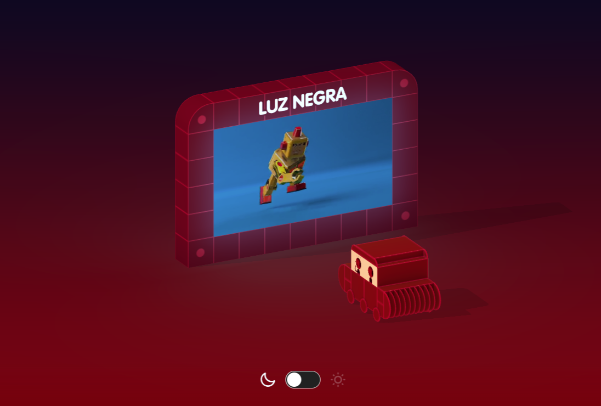

# Luz Negra portfolio

Portfolio for [Luz Negra](https://luz-negra.com), a multimedia design studio.



## Features

- Three.js scene with night/day mode
- Custom 3D models as gltf
- Video texture
- [Nuxt 3](https://nuxtjs.org) (Vue.js v3)
- [daisyUI](https://daisyui.com) & [Tailwind CSS](https://tailwindcss.com)
- Responsive (tablet & mobile friendly)
- [Contentful](https://www.contentful.com) CMS for media storage
- Contact form using [Formspark](https://formspark.io/) and [Turnstile](https://www.cloudflare.com/products/turnstile/) for CAPTCHA

## Local Development

> **Warning**
>
>This repo was not intended to be a template. It does not work out of the box and you will need to replace Contentful related stuff and use your own credentials.

```bash
# install dependencies
$ yarn install
# serve with hot reload at localhost:3000
$ yarn dev
# build for production and launch server
$ yarn build
$ yarn start
# generate static project
$ yarn generate
```
