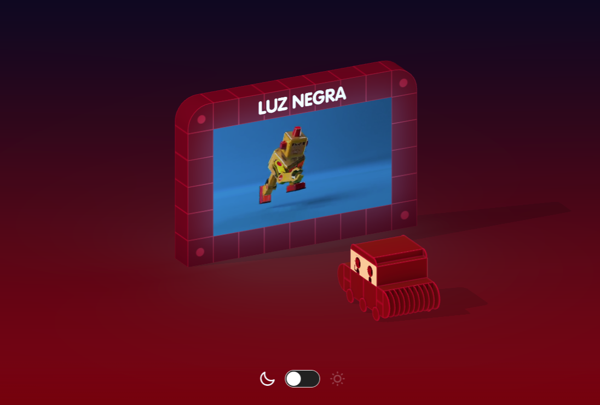

# Luz Negra Portfolio

A premium, interactive 3D and multimedia portfolio built for [Luz Negra](https://luz-negra.com), a creative design and animation studio. 



---

## 🚀 Key Features

*   **Immersive 3D Experience**: Integrated orthographic **Three.js** canvas (`HeroOnOffOrtho.vue`) displaying daylight/night transitions, custom `.gltf` 3D assets, dynamic lighting, and real-time video textures.
*   **Decoupled Content Management**: Server-driven content using **Contentful CMS** delivered through custom GraphQL queries (`nuxt-graphql-client`) with zero boilerplate.
*   **Fully Internationalized**: Multilingual support (Spanish & English) via `@nuxtjs/i18n` with auto-routing and standard localization directories (`/lang`).
*   **Custom Dark UI**: Styled using **Tailwind CSS** and **daisyUI** with a bespoke theme tailored around Luz Negra's brand colors (slate charcoal, active orange, and electric purple).
*   **Secured Contact Flow**: A seamless contact form relying on **Formspark** for delivery and Cloudflare **Turnstile** for invisible CAPTCHA security.
*   **Optimized Performance**: Built on **Nuxt 3** with modern Vite build-steps and fully responsive views on desktop, tablet, and mobile layouts.

---

## 🛠️ Technology Stack

*   **Framework**: [Nuxt 3](https://nuxt.com/) (Vue 3, SSR enabled)
*   **3D Engine**: [Three.js](https://threejs.org/) (GLTFLoader, OrbitControls)
*   **Styling**: [Tailwind CSS](https://tailwindcss.com/) & [daisyUI](https://daisyui.com/)
*   **API**: [GraphQL](https://graphql.org/) via `nuxt-graphql-client`
*   **Interactive Control**: [Tweakpane](https://cocopon.github.io/tweakpane/) (for 3D runtime scene fine-tuning)
*   **Animation**: [GSAP](https://gsap.com/) & [AOS](https://michalsnik.github.io/aos/) (Animate on Scroll)
*   **Security**: Cloudflare [Turnstile](https://www.cloudflare.com/products/turnstile/)
*   **Package Manager**: [pnpm v10](https://pnpm.io/)

---

## 📂 Directory Layout

```bash
├── assets/          # Global styles, fonts, and base stylesheets
├── components/      # Reusable Vue components (Header, Footer, 3D Hero, LangSwitcher)
│   └── project/     # Modular building blocks for portfolio items (Meta, Body, Media)
├── lang/            # Translation keys for localization (es.json, en.json)
├── layouts/         # Site wrapper structures
├── pages/           # Application views & file-based routing
│   └── proyecto/    # Dynamic, slug-based portfolio project routes
├── public/          # Static files, images, 3D models, and assets
├── queries/         # GraphQL query files (.gql) mapped directly by Nuxt
├── tailwind.config.js # Tailored daisyUI brand theme and font setups
└── nuxt.config.ts   # Core Nuxt modules, plugins, and runtime credentials configuration
```

---

## ⚙️ Configuration & Environment

To run the application locally, you will need a `.env` file containing your Contentful and Turnstile credentials:

```bash
# .env
CONTENT_KEY="your-contentful-preview-or-delivery-api-key"
SPACE_ID="your-contentful-space-id"
ACCESS_TOKEN="your-contentful-access-token"
TURNSTILE_SECRET_KEY="your-cloudflare-turnstile-secret-key"
```

---

## 💻 Local Development

Make sure you have [Node.js](https://nodejs.org/) (v20+) and [pnpm](https://pnpm.io/) installed.

```bash
# 1. Install dependencies
pnpm install

# 2. Run the development server (with HTTPS/SSL certs local fallback)
pnpm dev --host

# 3. Build the application for production
pnpm build

# 4. Preview the production build locally
pnpm preview

# 5. Prerender/generate static pages (SSG)
pnpm generate
```

---

*Made with 🧡 and 🪄 by Luz Negra.*
